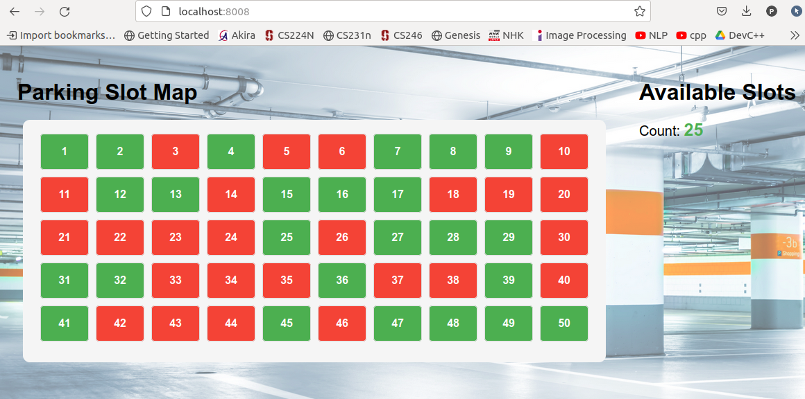

# Parking Slot IOT

## Tổng quan thiết kế

1. [Cảm biến](docs/IoT_SmartParking_DEMO_ver1.2.pdf): Thu thập và gửi tín hiệu về PC trung tâm.
2. Producer: Luồng giả lập tín hiệu cảm biến (tương tự như cảm biến).
3. Consumer: Đọc tín hiệu khi cảm biến gửi về và gửi vào queue để lưu giữ trạng thái.
4. Database: Lưu giữ trạng thái stateful khi có xe vào slot hoặc rời slot, bao gồm: thời gian bắt đầu, thời gian kết thúc, slot nào, ...?
5. Front-end: Hiển thị thông tin và trạng thái slots lên giao diện.

## Hướng dẫn triển khai

1. Cấu hình:

* Cấu hình địa chỉ ip của PC trung tâm (system.host) trong file: `env/prod.json`
* Cấu hình thời gian update trạng thái (system.time_interval)
* Cấu hình số lượng slots hiện có (system.num_slots)

```
"system": {
    "time_interval": 5,
    "num_slots": 50,
    "host": "127.0.0.1",
    "port": 8008
  }
```

* Cấu hình số lượng `rows` và `columns` trên frond-ent trong file: `/static/js/script.js`:
```
document.addEventListener("DOMContentLoaded", function() {
const numRows = 5;
const numCols = 10;
```

* Cấu hình thời gian update trạng thái trên front-end:
```
// Update the parking status every 5 seconds (adjust interval as needed)
setInterval(updateParkingStatus, 5000);

// Initial update to display the slots when the page loads
updateParkingStatus();
```

2. Deloy:

```sh
docker-compose up -d
```

Truy cập url: http://127.0.0.1:8008 để xem trạng thái các slot

